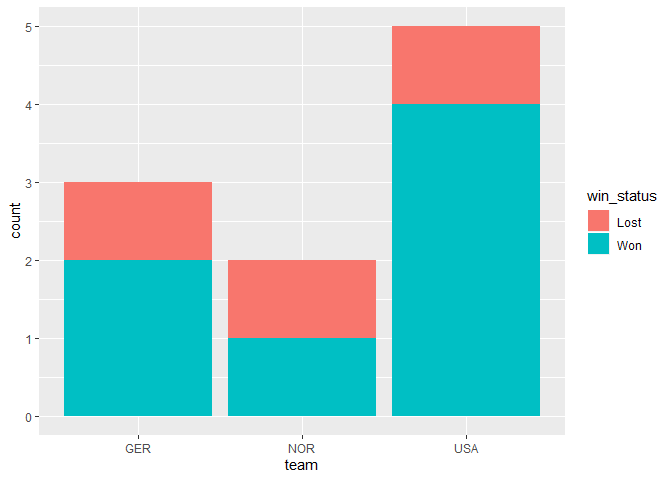

Ojectif du projet:
Je suppose que je travaille pour une Compagnie qui veut faire du bussiness autour de la WWC. Comme par exemple founir un service aux equipes participantes. Ma compagnie souhaite cependant se focaliser sur une ou deux equipes d'interet.


```r
# Installation des librarys 

library(tidyverse)
```

```
## -- Attaching packages ------------------------------------------------------ tidyverse 1.2.1 --
```

```
## v ggplot2 3.2.1     v purrr   0.3.2
## v tibble  2.1.3     v dplyr   0.8.3
## v tidyr   1.0.0     v stringr 1.4.0
## v readr   1.3.1     v forcats 0.4.0
```

```
## -- Conflicts --------------------------------------------------------- tidyverse_conflicts() --
## x dplyr::filter() masks stats::filter()
## x dplyr::lag()    masks stats::lag()
```

```r
wwc_outcomes <- readr::read_csv("https://raw.githubusercontent.com/rfordatascience/tidytuesday/master/data/2019/2019-07-09/wwc_outcomes.csv")
```

```
## Parsed with column specification:
## cols(
##   year = col_double(),
##   team = col_character(),
##   score = col_double(),
##   round = col_character(),
##   yearly_game_id = col_double(),
##   team_num = col_double(),
##   win_status = col_character()
## )
```
Pour avoir une idée du contenu des données utilisations de glimpse.
En cliquant aussi sur les données dans la fenetre global environment on arrive a visualiser le contenu qui s'affiche sous forme de table.
Brievement le tableau donne les statistiques par année (score = nombre de buts, le niveau de la competition = round, le win_status) de chaque equipe participante. On a egalement le nombre de matchs jouer = yearly_game_id 


```r
glimpse(wwc_outcomes)
```

```
## Observations: 568
## Variables: 7
## $ year           <dbl> 1991, 1991, 1991, 1991, 1991, 1991, 1991, 1991,...
## $ team           <chr> "CHN", "NOR", "DEN", "NZL", "JPN", "BRA", "GER"...
## $ score          <dbl> 4, 0, 3, 0, 0, 1, 4, 0, 2, 3, 0, 5, 4, 0, 2, 2,...
## $ round          <chr> "Group", "Group", "Group", "Group", "Group", "G...
## $ yearly_game_id <dbl> 1, 1, 2, 2, 3, 3, 4, 4, 5, 5, 6, 6, 7, 7, 8, 8,...
## $ team_num       <dbl> 1, 2, 1, 2, 1, 2, 1, 2, 1, 2, 1, 2, 1, 2, 1, 2,...
## $ win_status     <chr> "Won", "Lost", "Won", "Lost", "Lost", "Won", "W...
```

En premier je me pose comme question: Est ce une competition perenne? L'entreprise vise t elle quelque chose prometrice. Par exemple la competition s'ameliore t-elle au fil des années? ou regresse t elle? 
Je pense pouvoir repondre a cette question en etudiant l'evolution du nombre de match par année.


```r
#Calcul du nombre maximum de match par an, je sauvegarde ce calcul comme g pour l'utiliser plutard par ggplot.

g = wwc_outcomes %>%
       group_by(year)%>%
          summarise(nomber_of_game = max(yearly_game_id))
                    
ggplot (g, aes(x=year, y=nomber_of_game)) + geom_line( color = 'blue')
```

<!-- -->
Interpretation: Le wwc existe depuis 30 ans avec des nombres de match qui sont passés de 25 environ a plus de 50 en 30 ans. La competion semble perenne.

Question suivante:
Quel equipe serait la plus interessante a viser pour ce bussiness?
Pour maximiser la chance de ma compagnie de proposer un servise plus long, il serait plus avantageux de choisir un pays qui participe souvent et qui a la chance d aller loin dans la competition.En d'autre terme on recherche une equipe performante.  

Pour ce faire, etudions le nombre de but marrqué par equipe chaque année.

```r
ggplot(wwc_outcomes, aes(x=year, y= score)) + geom_point() + facet_wrap(~team)
```

<!-- -->

Les equipe qui semblent constantes et qui scorent le plus sont: GER, NOR, USA.

Focalisons sur ces 3 pays.

```r
# Utilisation de filter pour selectionner les 3 teams.
b= wwc_outcomes %>%
        filter(team == 'USA'|team == 'GER' | team == 'NOR' )
b
```

```
## # A tibble: 134 x 7
##     year team  score round         yearly_game_id team_num win_status
##    <dbl> <chr> <dbl> <chr>                  <dbl>    <dbl> <chr>     
##  1  1991 NOR       0 Group                      1        2 Lost      
##  2  1991 GER       4 Group                      4        1 Won       
##  3  1991 USA       3 Group                      5        2 Won       
##  4  1991 NOR       4 Group                      7        1 Won       
##  5  1991 USA       5 Group                     11        2 Won       
##  6  1991 GER       3 Group                     12        2 Won       
##  7  1991 USA       3 Group                     13        2 Won       
##  8  1991 NOR       2 Group                     16        1 Won       
##  9  1991 GER       1 Group                     18        2 Won       
## 10  1991 USA       7 Quarter Final             20        1 Won       
## # ... with 124 more rows
```

```r
ggplot(b, aes(x=year, y= score, color = score)) + geom_point() + facet_wrap(~team)
```

<!-- -->
	
	On confirme que ces 3 pays sont constantes pour ce qui est de la participation a cette competion. Elles marquent beaucoup de buts a plusieurs de leurs rencontres. 
	
	Pour team USA quel serait la repartition des scores en fonction des phases de la competion?

```r
a = wwc_outcomes %>%
     select(year, score, team, round)%>%
        filter(team == 'USA')%>%
          arrange(round)

a
```

```
## # A tibble: 50 x 4
##     year score team  round
##    <dbl> <dbl> <chr> <chr>
##  1  1991     2 USA   Final
##  2  1999     0 USA   Final
##  3  2011     2 USA   Final
##  4  2015     5 USA   Final
##  5  2019     2 USA   Final
##  6  1991     3 USA   Group
##  7  1991     5 USA   Group
##  8  1991     3 USA   Group
##  9  1995     3 USA   Group
## 10  1995     2 USA   Group
## # ... with 40 more rows
```

```r
ggplot(a, aes(x=year, y = score, group= round)) + geom_point(aes (color= round))+ facet_wrap(~round)
```

<!-- -->
	
Les trois equipes semblentde bons choix pour les departager on pourrait regarder laquelle a disputer le plus de finales et emporter le plus la competition


```r
#Filtre sur la final avant de filtrer sur les equipes
a = wwc_outcomes %>%
     select(year, score, team, round, win_status)%>%
        filter(round== 'Final')%>% 
        filter(team == 'USA'|team == 'GER' | team == 'NOR' )
a 
```

```
## # A tibble: 10 x 5
##     year score team  round win_status
##    <dbl> <dbl> <chr> <chr> <chr>     
##  1  1991     1 NOR   Final Lost      
##  2  1991     2 USA   Final Won       
##  3  1995     0 GER   Final Lost      
##  4  1995     2 NOR   Final Won       
##  5  1999     0 USA   Final Won       
##  6  2003     2 GER   Final Won       
##  7  2007     2 GER   Final Won       
##  8  2011     2 USA   Final Lost      
##  9  2015     5 USA   Final Won       
## 10  2019     2 USA   Final Won
```

```r
ggplot(a, aes(x=team, y=year, color = win_status)) + geom_point()
```

<!-- -->

```r
ggplot(a, aes(x=team, y=year)) + geom_boxplot(aes(fill = win_status))
```

<!-- -->

```r
ggplot(a, aes(team)) + geom_bar(aes(fill = win_status))
```

<!-- -->
	
	Je trouve la representation en point beaucoups plus informative que les barres.
	On voit ainsi que les USA se departagent du lot avec 5 finales jouées dont 4 remportées.
	
